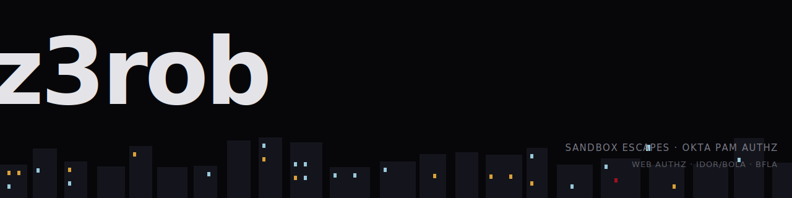

<picture>
  <source media="(prefers-color-scheme: dark)" srcset="assets/banner-dark.svg">
  <source media="(prefers-color-scheme: light)" srcset="assets/banner-light.svg">
  
</picture>

 

> breaking authz logic on identity platforms. mostly Okta.

<picture>
  <source media="(prefers-color-scheme: dark)" srcset="assets/stat-strip-dark.svg">
  <source media="(prefers-color-scheme: light)" srcset="assets/stat-strip-light.svg">
  
</picture>

 

> currently: `[[ Okta PAM / Access Governance authz research · sandbox escapes ]]`

### disclosures

| Program | Class | Severity | Status | Date |
|---|---|---|---|---|
| `[[ program ]]` | `[[ IDOR / BOLA / BFLA / Broken Access Control ]]` | `[[ P1-P4 ]]` | `[[ Resolved / Triaged ]]` | `[[ YYYY-MM ]]` |
| `[[ program ]]` | `[[ class ]]` | `[[ severity ]]` | `[[ status ]]` | `[[ date ]]` |
| `[[ program ]]` | `[[ class ]]` | `[[ severity ]]` | `[[ status ]]` | `[[ date ]]` |

Full disclosure ledger &rarr; `[[ site url ]]`

tools

 

`bugcrowd-mcp` &mdash; read-only FastMCP server over the Bugcrowd API
`Burp Suite` &mdash; proxy / repeater for manual request tampering
`Obsidian` &mdash; vulnerability research and tooling knowledge base
`Kali Linux (WSL2)` &mdash; primary testing environment
`Claude Code` &mdash; MCP-integrated recon and analysis workflow

eJPT &middot; eWAPT &mdash; INE Security

`[[ writeups ]]` &middot; `[[ disclosures ]]` &middot; `[[ pgp ]]` &middot; `[[ contact ]]`
